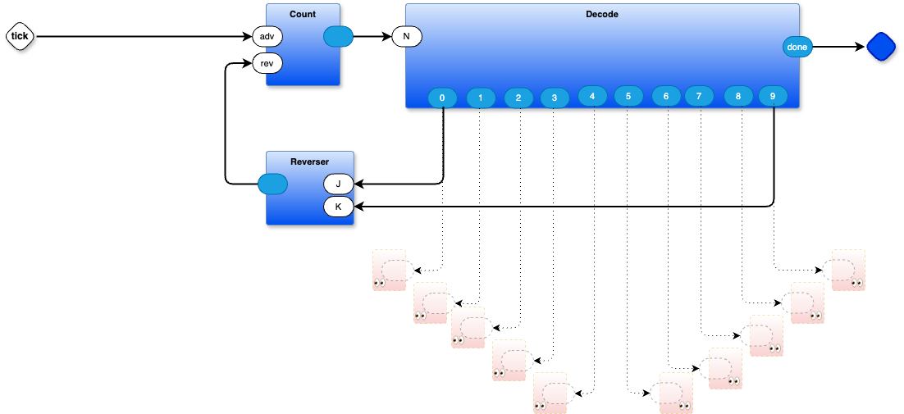

# Larson scanner written as a diagram
- source code written in a DPL (Diagrammatic Programming Language)

- Larson scanner on command line in 0D
- Larson used the scanner in his show Knight Rider
  - https://en.wikipedia.org/wiki/Glen_A._Larson
  - https://shop.evilmadscientist.com/productsmenu/152
# usage
## stripped down
uses main.py which uses global variables and does no error checking
`make`
## full
`make full`
uses main-full.py which creates Objects on the heap and does some error checking
# Tour
- see `scanner3.drawio` (use the drawio editor https://app.diagrams.net) to see the source code
  - note that the top level includes a feedback loop to keep the thing running
  - the feedback loop uses a Delay component, to slow the thing down to human speed
- see `main.py` to look at the lower-code Python implementation of Count, Reverser, Decode, and, Delay
- see `main-full.py` to see the Python implementation
- see `scanner3.drawio.json` to see the automatically-generated wiring lists
- see `py0d.py` for the full-blown implementation of the 0D kernel (it used to consist of several separate files), the concepts are simple, but when written out in a "modern" programming language, the code looks ugly (I think of it as assembler, anyway, and who bothers to look at assembler? I create source code as pictures).
# N.B.
- the wiring list compiler is currently written in Odin (only)
  - you don't need to install Odin if you already have scanner3.drawio.json
  - currently 0D/das2json is compiled for MacOS, you don't need to install Odin if you're on a Mac
  - you do need Odin and 0D/das2jon if you are on Windows or Linux and want to make changes to the diagram (scanner3.drawio)
  - I'm working on a version of das2json written in Python, which should be more easily available on all O/Ses
- components written in Python 0D can use components written in other languages, thanks to VSH (included, Visual SHell)
- I strive for MVI (Minimum Viable Implementation) - skimp on efficiency instead of MVP-style skimping on product
  - make it correct first, then optimize
  - if it's useful, then someone will figure out how to make it faster / better
  - avoid premature optimization (which seems to be encouraged by "modern" programming languages)
